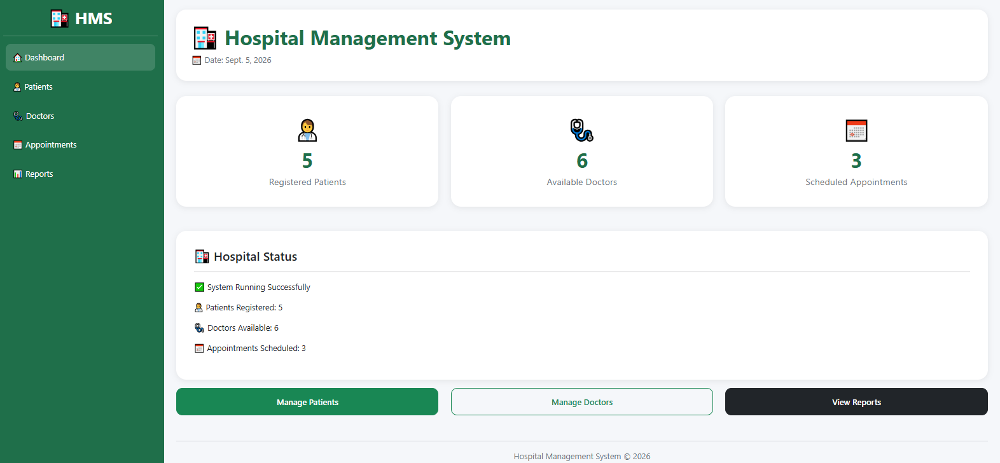
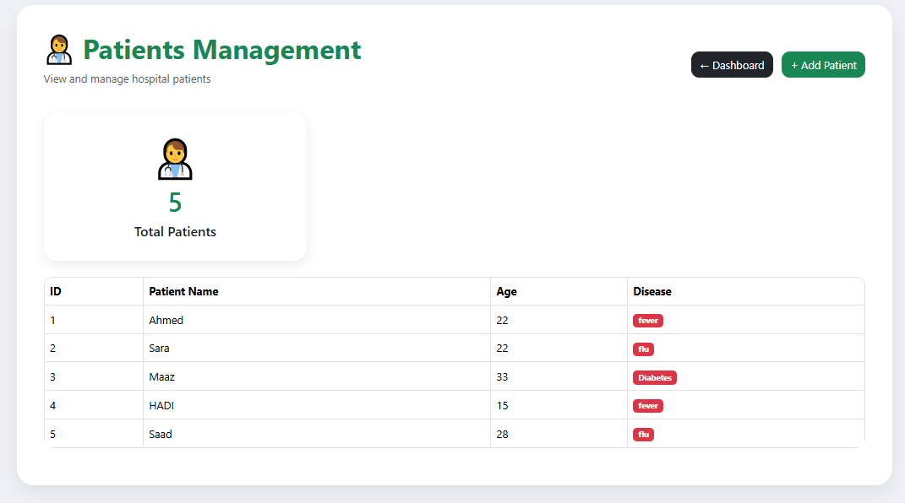
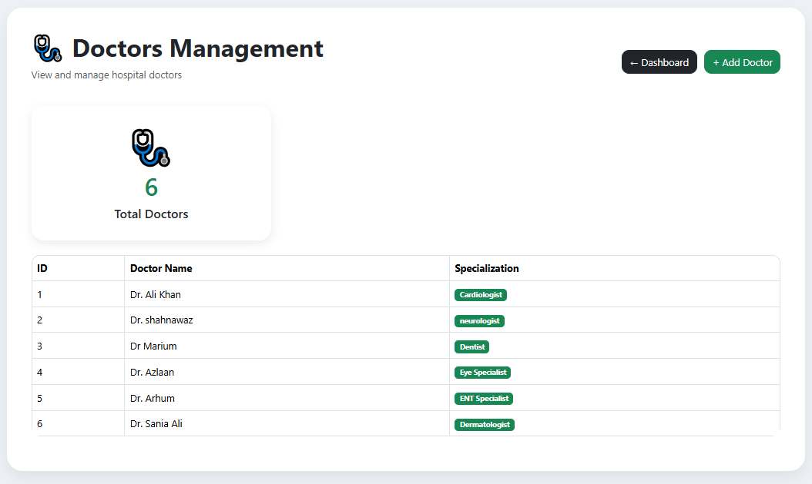
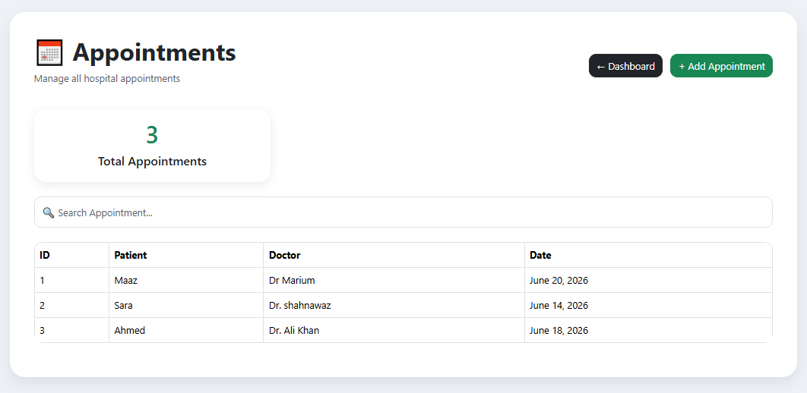
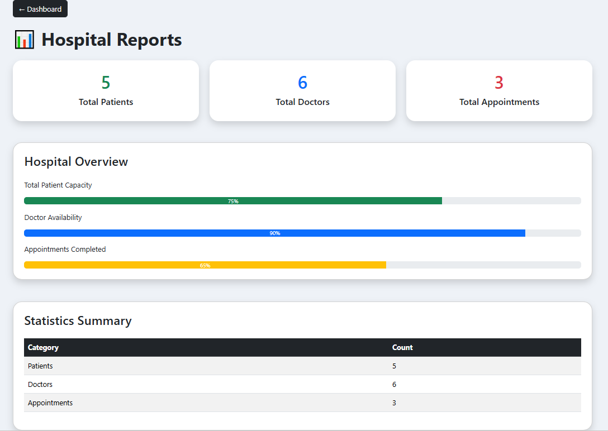

# MediCare HMS - Hospital Management System

A modern, full-featured Hospital Management System built with **Django**.

Manage patients, doctors, appointments, departments, billing, and reports through a clean and responsive web interface.

---

## ✨ Features

- **Dashboard** – Live statistics (patients, doctors, appointments, revenue, unpaid bills)
- **Patients** – Full CRUD, search, detailed profile with appointment & billing history
- **Doctors** – Manage doctors with specialization, department, experience & availability
- **Appointments** – Book appointments with date, time and status workflow  
  (Pending → Confirmed → Completed / Cancelled / No-show)
- **Departments** – Organize doctors by department
- **Billing** – Create bills, track payments, and mark bills as paid
- **Reports & Analytics** – Revenue overview, appointment status breakdown, top doctors
- **Modern UI** – Responsive design with Bootstrap 5 + Bootstrap Icons
- **Django Admin** – Fully customized admin panel

---

## 🛠️ Tech Stack

- **Backend:** Django 5 / 6
- **Database:** SQLite (easily switchable to PostgreSQL / MySQL)
- **Frontend:** Bootstrap 5, Bootstrap Icons
- **Forms:** Django ModelForms

---

## 🚀 Getting Started

### 1. Clone the repository
```bash
git clone https://github.com/Sumairakamil/hospital-management-system.git
cd hospital-management-system
```

### 2. Create virtual environment (recommended)
```bash
python -m venv venv
venv/Scripts/activate        # On Windows: venv\Scripts\activate
```
### 3. Install dependencies
```bash
pip install -r requirements.txt
```
### 4. Run migrations
```bash
python manage.py migrate
```
### 5. Create superuser (optional)
```bash
python manage.py createsuperuser
```
### 6. Run the development server
```bash
python manage.py runserver
```
Open your browser and go to:
**http://127.0.0.1:8000/**
---
## 🔑 Demo Admin Login

Use the following credentials to access the Django Admin Panel:

**Admin URL:** `/admin/`

**Username:** `admin`  
**Password:** `admin123`

> ⚠️ These are demo credentials for testing purposes only.
---
## 📁 Project Structure

```text
hospital_management/
│
├── hospital/
│   ├── migrations/
│   ├── templates/
│   ├── admin.py
│   ├── apps.py
│   ├── models.py
│   ├── tests.py
│   ├── urls.py
│   └── views.py
│
├── hospital_management/
│   ├── settings.py
│   ├── urls.py
│   ├── asgi.py
│   └── wsgi.py
│
├── screenshots/
│   ├── dashboard.png
│   ├── patients.png
│   ├── doctors.png
│   ├── appointments.png
│   └── reports.png
│
├── .gitignore
├── manage.py
└── README.md
```
---
## 📸 Screenshots

### Dashboard


### Patients


### Doctors


### Appointments


### Reports

---
## 🔮 Future Enhancements

- 🔐 User authentication and role-based access
- 🏥 Department and ward management
- 💊 Pharmacy and medicine management
- 🧪 Laboratory management
- 💳 Online billing and payment integration
- 📋 Detailed medical history
- 📧 Appointment notifications
- 📊 Advanced analytics
- 📱 Improved mobile responsiveness
---
## 🤝 Contributing

Contributions are welcome! Feel free to fork the repository, create a new branch, make your changes, and submit a pull request.

---
## 📝 License

This project is available under the MIT License.

---
## 👩‍💻 Author

**Sumaira Kamil**  
Artificial Intelligence Student

⭐ If you find this project useful, consider giving the repository a star!